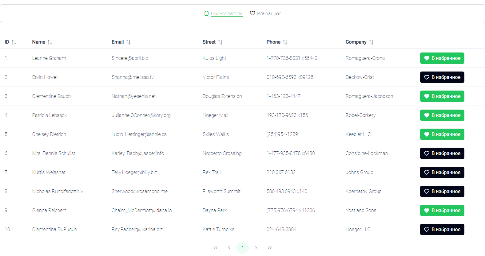
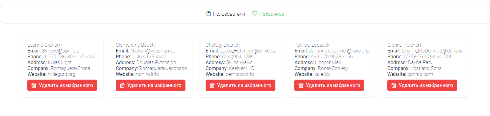

## Рада Вас приветствовать!

Меня зовут Анастасия Сухова, и я - Frontend разработчик.
Сейчас вы читаете описание к моему проекту, который создан в качестве тестового задания для компании Смартпойнт на позицию Frontend-разработчик.

## Что он делает?

Проект представляет собой страницу с тремя компонентами: Меню (хедер), Пользователи и Избранное.

В компоненте Пользователи представлена таблица пользователей с их данными.
Вы можете добавить строку с конкретным пользователем в Избранное с помощью кнопки справа.



Список избранных пользователей отображается в компоненте Избранное.



Переключение между компонентами осуществляется через Меню.

## Как это написано?

Данные в таблицу подгружаются с [JSONPlaceholder](https://jsonplaceholder.typicode.com/users) через Axios.

Переключение между компонентами в Меню осуществляется с помощью Vue Router.

При добавлении пользователя в избранное его данные забрасываются в стор, а оттуда подгружаются в компонент Избранное. Осуществляется это с помощью Pinia. Стор находится в src/stores/favorites.ts

Стили написаны на CSS и с использованием PrimeVue.

## Какой стек?

Стек: HTML, CSS, TypeScript, Vue 3, Composition API, Vue Router, Axios, Pinia, PrimeVue.

## Установка

```sh
npm install
```

### Запуск проекта

```sh
npm run dev
```
